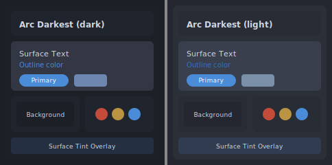
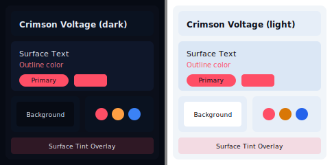
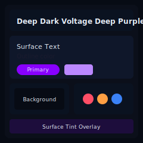
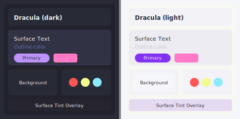
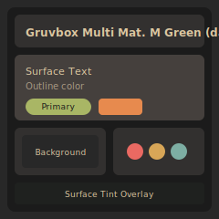
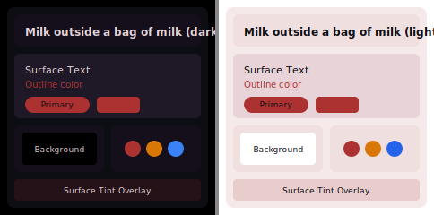
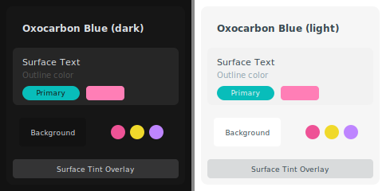
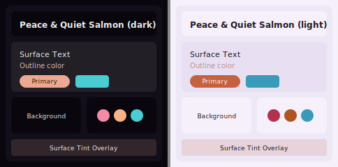
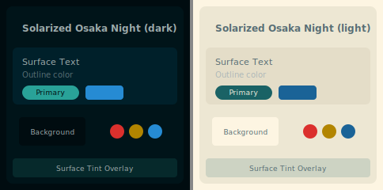
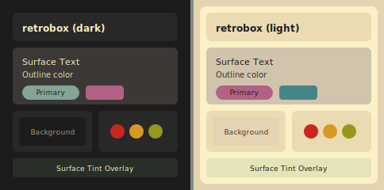

<!-- DO NOT EDIT THIS FILE, EDIT README_TEMPLATE.md, this README.md is auto generated. -->

# Dank Material Shell Plugins

This repository contains a collection of plugins for [Dank Material Shell](https://github.com/AvengeMedia/DankMaterialShell)

[https://plugins.danklinux.com/](https://plugins.danklinux.com/)

## Contributing

To add your Plugin to the list please read the [contribution guidelines](CONTRIBUTING.md) and create a pull request.

## Installing Plugins

### Via DMS Settings UI

On DMS open the settings <kbd>Mod + ,</kbd> go to **Plugins** tab and click on **Browse** button.

### Via dms CLI

On your teminal run `dms` then navigate to the **plugins** option or run `dms plugins install {plugin-name}` directly.

### Manually

Clone the plugin repository into your `~/.config/DankMaterialShell/plugins/` folder and restart your dms session with `dms restart`. NOTE: Some plugins may have additional dependencies that need to be installed manually, please refer to the plugin documentation for more information, some plugins are part of a monorepo and need to be installed by copying the relevant path to the plugins folder.

### With Nix

Follow the [Nix usage documentation](/nix/README.md)

## Disclaimer

Some plugins are created by third-party developers and are not officially supported by the Dank Material Shell team. Use them at your own risk. In case of issues, please contact the plugin author directly.

## Plugins

**Categories:** [Stock](#stock) | [Appearance](#appearance) | [Finance](#finance) | [Media](#media) | [Monitoring](#monitoring) | [Productivity](#productivity) | [Social](#social) | [System](#system) | [Utilities](#utilities) | [Utility](#utility) | [Weather](#weather)

---

### Stock

#### [Stock Manager](https://github.com/leemeng0x61/stockManager)

Simple Chinese A-share stock market monitoring plugin

<strong>requires DMS version</strong>: <em>>=1.2.0</em>

- id: stockManager
- name: Stock Manager
- author: LeeMeng
- compositors: any
- capabilities: dank-widget
- dependencies: curl, iconv
- distro: any

Screenshot

---

### Appearance

#### [Cava Visualizer](https://github.com/ernestowgg/cava-visualizer)

A simple, customizable audio visualizer for your desktop

- id: cavaVisualizer
- name: Cava Visualizer
- author: ernestowgg
- compositors: any
- capabilities: desktop-widget
- dependencies: cava
- distro: any

Screenshot

#### [Dank Terminal Theme](https://github.com/eduardez/DankTerminalTheme)

Real-time Ghostty theme management from the navbar

<strong>requires DMS version</strong>: <em>>=1.4.0</em>

- id: dankterminaltheme
- name: Dank Terminal Theme
- author: EduarD3V
- compositors: any
- capabilities: terminal, dankbar-widget
- dependencies: ghostty
- distro: any

Screenshot

#### [Linux Wallpaper Engine](https://github.com/sgtaziz/dms-wallpaperengine)

Animated wallpaper support using linux-wallpaperengine with Steam Workshop scenes

- id: linuxWallpaperEngine
- name: Linux Wallpaper Engine
- author: sgtaziz
- compositors: any
- capabilities: wallpaper, animation
- dependencies: linux-wallpaperengine
- distro: any

Screenshot

#### [Media Frame](https://codeberg.org/claymorwan/dms-plugins)

Desktop plugin to display a picture on your desktop

- id: mediaFrame
- name: Media Frame
- author: claymorwan
- compositors: any
- capabilities: desktop-widget
- dependencies: 
- distro: any

> [!NOTE]
> This plugin is part of a monorepo, please copy the contents of the [mediaFrame](https://codeberg.org/claymorwan/dms-plugins/tree/main/mediaFrame) folder to your `~/.config/DankMaterialShell/plugins/` folder.

Screenshot

#### [Wallpaper Shuffler](https://github.com/Daniel-42-z/dms-wallpaper-shuffler)

Shuffles wallpapers with a given time interval, finds wallpapers recursively inside the specified folder

- id: wallpaperShufflerPlugin
- name: Wallpaper Shuffler
- author: Daniel-42-z
- compositors: any
- capabilities: set-wallpaper
- dependencies: 
- distro: any

Screenshot

#### [Wallpaper of the Day](https://github.com/max72bra/DankPluginBingWallpaper)

A new fresh daily wallpaper downloaded from a famous portal

- id: wallpaperBing
- name: Wallpaper of the Day
- author: maxb
- compositors: any
- capabilities: wallpaper-downloader, wallpaper-set, daemon
- dependencies: curl
- distro: any

Screenshot

#### [Wallpaper of the Day (Widget)](https://github.com/max72bra/DankPluginBingWallpaperWidget)

A new fresh daily wallpaper downloaded from a famous portal (Widget)

- id: wallpaperBingWidget
- name: Wallpaper of the Day (Widget)
- author: maxb
- compositors: any
- capabilities: dankbar-widget
- dependencies: 
- distro: any

Screenshot

#### [mpvpaper Video Wallpaper](https://github.com/kanghengliu/dms-mpvpaper)

Video wallpaper support using mpvpaper

- id: mpvpaperWallpaper
- name: mpvpaper Video Wallpaper
- author: kanghengliu
- compositors: niri, hyprland
- capabilities: wallpaper, animation, dankbar-widget
- dependencies: mpvpaper
- distro: any

Screenshot

---

### Finance

#### [Markets](https://github.com/TMS-Namespace/DMS-Markets-Plugin)

Semi-Live market prices for currencies, stocks, and commodities with charts

- id: markets
- name: Markets
- author: TMS-Namespace
- compositors: niri
- capabilities: dankbar-widget
- dependencies: curl
- distro: fedora

Screenshot

---

### Media

#### [Dank Audio Visualizer](https://github.com/odtgit/DankAudioVisualizer)

Circular audio visualizer with bars, wave, rings, and bloom effects. Ported from Noctalia's fancy-audiovisualizer by Lemmy / Noctalia Team.

<strong>requires DMS version</strong>: <em>>=1.2.0</em>

- id: dankAudioVisualizer
- name: Dank Audio Visualizer
- author: odtgit
- compositors: any
- capabilities: desktop-widget
- dependencies: cava
- distro: any

Screenshot

---

### Monitoring

#### [AMD GPU Monitor](https://github.com/navidagz/dms-amd-gpu-monitor)

Monitor AMD GPU usage, VRAM, temperature, power consumption and process usage.

- id: amdGpuMonitor
- name: AMD GPU Monitor
- author: navidagz
- compositors: any
- capabilities: dankbar-widget
- dependencies: amdgpu_top
- distro: any

Screenshot

#### [AMD GPU Monitor Revive](https://github.com/JDKamalakar/DMS-AMD_GPU_Monitor_Revive)

Monitor AMD GPU usage, VRAM, temperature, power consumption and process usage with updated UI.

- id: amdGpuMonitorRevive
- name: AMD GPU Monitor Revive
- author: JDKamalakar.
- compositors: any
- capabilities: dankbar-widget, monitoring
- dependencies: amdgpu_top
- distro: any

Screenshot

#### [Air Quality](https://github.com/szabolcsf/dms-air-quality)

Display the current Air Quality Index (AQI) on the bar with detailed pollutant breakdown. Supports US and European AQI scales with auto-location.

- id: airQuality
- name: Air Quality
- author: Szabolcs Fazekas
- compositors: any
- capabilities: dankbar-widget
- dependencies: curl
- distro: any

Screenshot

#### [Audio Inhibit](https://github.com/insecure/dms-audio-inhibit)

Enables idle inhibitor if audio is playing.

- id: audioInhibit
- name: Audio Inhibit
- author: Tobias Hommel
- compositors: any
- capabilities: audio, monitoring
- dependencies: 
- distro: any

Screenshot

#### [Cat Widget](https://github.com/xi-ve/cat-dms)

An animated running cat for the DankBar whose speed reflects CPU usage. Based on CatWalk by Driglu4it.

- id: catWidget
- name: Cat Widget
- author: kemo
- compositors: any
- capabilities: dankbar-widget
- dependencies: 
- distro: any

Screenshot

#### [Claude Code Usage](https://github.com/titeya/dms-claudecode)

Monitor your Claude Code subscription usage with token tracking, rate limits, and daily activity charts

- id: claudeCodeUsage
- name: Claude Code Usage
- author: Nicolas Bellamy
- compositors: any
- capabilities: dankbar-widget
- dependencies: jq
- distro: any

Screenshot

#### [CodexBar](https://github.com/zakstam/dms-codexbar)

Monitor AI provider usage quotas

- id: codexBar
- name: CodexBar
- author: zak
- compositors: niri, hyprland
- capabilities: dankbar-widget
- dependencies: 
- distro: any

Screenshot

#### [Dank UPS Monitor](https://github.com/acmagn/DMS-UPS-Monitor)

Real-time UPS status widget via NUT (upsc).

- id: dankUpsMonitor
- name: Dank UPS Monitor
- author: acmagn
- compositors: any
- capabilities: dankbar-widget
- dependencies: upsc
- distro: any

Screenshot

#### [Disk Usage](https://github.com/alcxyz/DankDiskUsage)

Monitor disk, ZFS pool, and Nix store usage with smart mount classification and expandable ZFS pool detail

- id: dankDiskUsage
- name: Disk Usage
- author: alcxyz
- compositors: any
- capabilities: dankbar-widget
- dependencies: 
- distro: any

Screenshot

#### [Game Controller Battery](https://github.com/Hujair/gameControllerBattery)

Shows the battery level of connected game controllers

- id: gameControllerBattery
- name: Game Controller Battery
- author: Mohammad Hujair
- compositors: niri, hyprland
- capabilities: dankbar-widget
- dependencies: upower
- distro: any

Screenshot

#### [GitHub Heatmap](https://github.com/boutabong/dms-plugins)

Display weekly GitHub contribution heatmap with color-coded activity levels

- id: githubHeatmap
- name: GitHub Heatmap
- author: Deppes
- compositors: niri
- capabilities: dankbar-widget
- dependencies: curl, jq, fish, libnotify, xdg-utils
- distro: arch

> [!NOTE]
> This plugin is part of a monorepo, please copy the contents of the [GitHubHeatMap](https://github.com/boutabong/dms-plugins/tree/main/GitHubHeatMap) folder to your `~/.config/DankMaterialShell/plugins/` folder.

Screenshot

#### [Hyprland Submap](https://github.com/mesteryui/DMS_HyprlandSubmap)

Shows the current submap in Hyprland

- id: hyprlandSubmap
- name: Hyprland Submap
- author: Mester
- compositors: hyprland
- capabilities: dankbar-widget
- dependencies: 
- distro: any

Screenshot

#### [NVIDIA GPU Monitor](https://github.com/TEJASJONDHALE/dms-nvidia-gpu-monitor)

Monitor NVIDIA GPU usage, VRAM, and temperature.

- id: nvidiaGpuMonitor
- name: NVIDIA GPU Monitor
- author: Tejas Jondhale
- compositors: any
- capabilities: dankbar-widget, monitoring
- dependencies: nvidia-smi
- distro: any

Screenshot

#### [Nix Monitor](https://github.com/antonjah/nix-monitor)

Monitor Nix store disk usage and system generations with integrated system management capabilities

- id: nixMonitor
- name: Nix Monitor
- author: Anton Andersson
- compositors: any
- capabilities: dankbar-widget
- dependencies: 
- distro: any

Screenshot

#### [Power Usage Monitor](https://github.com/Daniel-42-z/dms-power-usage)

Display real-time power consumption from your device

- id: powerUsagePlugin
- name: Power Usage Monitor
- author: Daniel-42-z
- compositors: any
- capabilities: dankbar-widget
- dependencies: 
- distro: any

Screenshot

#### [SSH Monitor](https://github.com/boutabong/dms-plugins)

Monitor active SSH, SFTP, FTP, and Yazi VFS connections with hostname resolution

- id: sshMonitor
- name: SSH Monitor
- author: Deppes
- compositors: niri
- capabilities: dankbar-widget
- dependencies: fish, procps-ng, net-tools
- distro: arch

> [!NOTE]
> This plugin is part of a monorepo, please copy the contents of the [SSH-Monitor](https://github.com/boutabong/dms-plugins/tree/main/SSH-Monitor) folder to your `~/.config/DankMaterialShell/plugins/` folder.

Screenshot

---

### Productivity

#### [Dank Todo](https://github.com/deepu105/dms-dank-todo)

A simple locally-saved TODO list widget for the Dank bar.

- id: dankTodo
- name: Dank Todo
- author: Deepu K Sasidharan
- compositors: niri
- capabilities: dankbar-widget
- dependencies: 
- distro: arch

Screenshot

---

### Social

#### [Discord Voice Widget](https://github.com/PandorasFox/dms-discord-widget)

Discord voice call overlay — shows participants as circular avatars with speaking/mute/deafen indicators. Supports mute/deafen keybinds and push-to-talk.

- id: discordVoice
- name: Discord Voice Widget
- author: PandorasFox
- compositors: niri, hyprland, sway
- capabilities: dankbar-widget
- dependencies: python3
- distro: any

Screenshot

---

### System

#### [ASUS Control Center](https://github.com/pseudofractal/AsusControl)

Manage Power Profiles and GPU Modes for ASUS Laptops directly from your DankBar.

- id: asusControlCenter
- name: ASUS Control Center
- author: pseudofractal
- compositors: any
- capabilities: dankbar-widget
- dependencies: asusctl, supergfxctl
- distro: any

Screenshot

#### [AdGuard VPN](https://github.com/bernardopg/dms-adguard-vpn-plugin)

Control, configure, and monitor adguardvpn-cli directly from DankBar

<strong>requires DMS version</strong>: <em>>=1.4.0</em>

- id: adguardVPplugin
- name: AdGuard VPN
- author: Bernardo Gomes
- compositors: any
- capabilities: vpn, network, dankbar-widget
- dependencies: adguardvpn-cli
- distro: any

Screenshot

#### [DDC Brightness](https://github.com/smithyyang/dms-brightness-plugin)

Control internal and external monitor brightness via brightnessctl and ddcutil

- id: ddcBrightness
- name: DDC Brightness
- author: youngshine
- compositors: hyprland
- capabilities: dankbar-widget
- dependencies: brightnessctl, ddcutil
- distro: any

Screenshot

#### [Dank System Doctor](https://github.com/NordicsSys/DankSystemDoctor)

AI-powered system health monitor. Tracks CPU, RAM, disk, GPU & temp; detects pending updates (apt/dnf/pacman/brew); one-click maintenance and snapshot guardrails; Ollama diagnostics with triage playbooks.

- id: dankSystemDoctor
- name: Dank System Doctor
- author: noxius
- compositors: any
- capabilities: system-monitor, ai-diagnostics, log-viewer, process-manager, updates, maintenance
- dependencies: bash, journalctl, ps, free, df
- distro: any

Screenshot

#### [Display Manager](https://github.com/felri/display-manager-plugin-niri-dank-linux)

Toggle Niri displays and control monitor hardware brightness, contrast, scale, refresh rate, and resolution.

- id: displayManager
- name: Display Manager
- author: felri
- compositors: niri
- capabilities: dankbar-widget
- dependencies: ddcutil
- distro: any

Screenshot

#### [Display Output](https://github.com/xyzsteven/dms-displayoutput)

Manage display outputs (Single Display, Mirror, Extend).

- id: displayOutput
- name: Display Output
- author: xyzsteven
- compositors: hyprland
- capabilities: manage-displays
- dependencies: socat
- distro: any

Screenshot

#### [Lenovo Battery Settings](https://github.com/neoscaler/dms-lenovo-battery-settings)

Manage Lenovo battery settings like conservation mode

- id: dmsLenovoBatterySettings
- name: Lenovo Battery Settings
- author: neoscaler
- compositors: any
- capabilities: dankbar-widget
- dependencies: ideapad_laptop, polkit-agent
- distro: any

Screenshot

#### [Next Boot Selector](https://github.com/arcatva/dms-next-boot-selector)

Pick which EFI boot entry to load on next reboot via efibootmgr. Bar pill + Control Center widget with a scrollable picker.

- id: nextBootSelector
- name: Next Boot Selector
- author: arcatva
- compositors: any
- capabilities: dankbar-widget, control-center
- dependencies: efibootmgr, sudo
- distro: any

Screenshot

#### [Package Updates](https://github.com/rahulmysore23/dms-pkg-update)

Check and manage DNF and Flatpak package updates from the bar.

- id: pkgUpdate
- name: Package Updates
- author: rahulmysore23
- compositors: niri, hyprland
- capabilities: dankbar-widget
- dependencies: 
- distro: fedora, any

Screenshot

#### [USB Manager](https://github.com/NordicsSys/dms-usb-manager)

Bar widget: monitor removable USB drives, mount/unmount, eject, format (FAT32/exFAT/ext4), resize partitions; notifications on plug/unplug via udisks.

<strong>requires DMS version</strong>: <em>>=1.2.0</em>

- id: usbManager
- name: USB Manager
- author: NordicsSys
- compositors: any
- capabilities: dankbar-widget, notify
- dependencies: udisks2, bash, lsblk, parted, dosfstools, e2fsprogs, exfatprogs, polkit
- distro: any

Screenshot

---

### Utilities

#### [AI Assistant](https://github.com/devnullvoid/dms-ai-assistant)

Integrated AI chat assistant with markdown support, multiple AI provider support, streaming responses, and persistent chat history

<strong>requires DMS version</strong>: <em>>=1.4.0</em>

- id: aiAssistant
- name: AI Assistant
- author: devnullvoid
- compositors: any
- capabilities: slideout, ai
- dependencies: curl, wl-copy
- distro: any

Screenshot

#### [Alarm Clock](https://github.com/lucyfire/dms-plugins)

An alarm clock widget

<strong>requires DMS version</strong>: <em>>=0.2.4</em>

- id: alarmClock
- name: Alarm Clock
- author: lucyfire
- compositors: any
- capabilities: dankbar-widget
- dependencies: qt6-multimedia
- distro: any

> [!NOTE]
> This plugin is part of a monorepo, please copy the contents of the [alarmClock](https://github.com/lucyfire/dms-plugins/tree/main/alarmClock) folder to your `~/.config/DankMaterialShell/plugins/` folder.

Screenshot

#### [Alienware Command Center](https://github.com/psyreactor/dms-awcc)

Alienware Command Center plugin for DankBar

<strong>requires DMS version</strong>: <em>>0.0.28</em>

- id: awcc
- name: Alienware Command Center
- author: psyreactor
- compositors: any
- capabilities: dankbar-widget
- dependencies: 
- distro: any

Screenshot

#### [Anime Calendar](https://github.com/RiceaRaul/DMS-AnimeCalendarPlugin)

A QuickShell plugin for DankMaterialShell that tracks anime episode releases and sends notifications when your favorite shows air.

- id: animeCalendar
- name: Anime Calendar
- author: Ricea Ion Raul
- compositors: any
- capabilities: dankbar-widget
- dependencies: 
- distro: any

Screenshot

#### [Application Shortcut](https://github.com/oabragh/AppShortcut)

Add application shortcuts in your desktop :)

<strong>requires DMS version</strong>: <em>>=1.2.0</em>

- id: appShortcut
- name: Application Shortcut
- author: Omar (@oabragh)
- compositors: any
- capabilities: desktop-widget
- dependencies: 
- distro: any

Screenshot

#### [Audio Slots IPC](https://github.com/lpv11/dms-audio-slots)

Daemon plugin for cycling saved output/input device slots and toggling focused-app mute via DMS IPC.

- id: audioSlots
- name: Audio Slots IPC
- author: lpv11
- compositors: hyprland
- capabilities: audio, ipc, daemon
- dependencies: pactl, awk
- distro: any

Screenshot

#### [Audio Switcher](https://github.com/CD-Z/dms-plugins)

Quickly toggle between different audio output devices

- id: audioSwitcher
- name: Audio Switcher
- author: CD-Z
- compositors: any
- capabilities: dankbar-widget
- dependencies: 
- distro: any

Screenshot

#### [Calculator](https://github.com/rochacbruno/DankCalculator)

A calculator plugin that evaluates mathematical expressions and copies results to clipboard

<strong>requires DMS version</strong>: <em>>=1.2.0</em>

- id: calculator
- name: Calculator
- author: Bruno Cesar Rocha
- compositors: any
- capabilities: launcher
- dependencies: 
- distro: any

Screenshot

#### [Canvas Grades](https://github.com/mcwiseman97/dms-canvas-plugin)

Courses, grades, upcoming assignments, missing work, and announcements from Canvas LMS

- id: canvasGrades
- name: Canvas Grades
- author: mcwiseman97
- compositors: niri, hyprland
- capabilities: dankbar-widget
- dependencies: curl, jq, bash
- distro: any

> [!NOTE]
> This plugin is part of a monorepo, please copy the contents of the [canvasGrades](https://github.com/mcwiseman97/dms-canvas-plugin/tree/main/canvasGrades) folder to your `~/.config/DankMaterialShell/plugins/` folder.

Screenshot

#### [Chinese Calendar](https://github.com/xxyangyoulin/dms-plugin-ccal)

Display Chinese lunar calendar with holiday information in the status bar

<strong>requires DMS version</strong>: <em>>=1.4.0</em>

- id: chineseCalendar
- name: Chinese Calendar
- author: xxyangyoulin
- compositors: any
- capabilities: calendar, dankbar-widget
- dependencies: ccal, curl
- distro: any

Screenshot

#### [Clight](https://github.com/AvengeMedia/dms-plugins)

Ambient light sensor control - automatic brightness and screen dimming

<strong>requires DMS version</strong>: <em>>=1.4.0</em>

- id: dankClight
- name: Clight
- author: Avenge Media
- compositors: any
- capabilities: dankbar-widget, control-center
- dependencies: clight
- distro: any

> [!NOTE]
> This plugin is part of a monorepo, please copy the contents of the [DankClight](https://github.com/AvengeMedia/dms-plugins/tree/main/DankClight) folder to your `~/.config/DankMaterialShell/plugins/` folder.

Screenshot

#### [ClipBoard+](https://github.com/Dadangdut33/dms-plugins)

Advanced clipboard manager with integrated notes, todo, and pinned items.

- id: clipboardPlus
- name: ClipBoard+
- author: Dadangdut33
- compositors: any
- capabilities: dankbar-widget
- dependencies: cliphist, wl-clipboard
- distro: any

> [!NOTE]
> This plugin is part of a monorepo, please copy the contents of the [ClipboardPlus](https://github.com/Dadangdut33/dms-plugins/tree/main/ClipboardPlus) folder to your `~/.config/DankMaterialShell/plugins/` folder.

Screenshot

#### [Command Runner](https://github.com/devnullvoid/dms-command-runner)

Execute shell commands from the launcher with history tracking, common shortcuts, and terminal/background execution modes

- id: commandRunner
- name: Command Runner
- author: devnullvoid
- compositors: any
- capabilities: launcher
- dependencies: 
- distro: any

Screenshot

#### [Custom Running Apps](https://github.com/heyitsmikey128/DankCustomRunningApps)

Flexible Custom Widget for Showing Running Apps on Dank Bar

- id: customRunningApps
- name: Custom Running Apps
- author: Michael Kushma
- compositors: niri
- capabilities: dankbar-widget
- dependencies: 
- distro: any

Screenshot

#### [DMS Agent](https://github.com/Francisdelca/dms-agent)

AI desktop assistant powered by Claude Code. Floating chat panel for controlling your desktop with natural language — open apps, switch windows, play music, search the web, and more.

- id: dmsAgent
- name: DMS Agent
- author: Francisdelca (Francis)
- compositors: niri
- capabilities: dankbar-widget
- dependencies: claude
- distro: any

Screenshot

#### [DMS Desktop Countdown](https://github.com/nfoert/dms-desktop-countdown)

Allows creating desktop widget countdowns with progress, view options, and the ability to only count certain days in a week

- id: dmsDesktopCountdown
- name: DMS Desktop Countdown
- author: nfoert
- compositors: niri, hyprland
- capabilities: desktop
- dependencies: 
- distro: any

Screenshot

#### [DMS Screenshot](https://github.com/JDKamalakar/DMS-Screenshot)

Control DMS screenshot actions from the Widget & Control Center

- id: dmsScreenshot
- name: DMS Screenshot
- author: JDKamalakar
- compositors: any
- capabilities: dankbar-widget, control-center
- dependencies: dms
- distro: any

Screenshot

#### [DMS Sessionizer](https://github.com/leonardofranco01/dms-sessionizer)

Create tmux sessions for your projects

- id: dmsSessionizer
- name: DMS Sessionizer
- author: leonardofranco01
- compositors: hyprland
- capabilities: launcher, command-execution, shell
- dependencies: tmux
- distro: any

Screenshot

#### [Dank Actions](https://github.com/AvengeMedia/dms-plugins)

Add customizable, scriptable actions to your bar.

- id: dankActions
- name: Dank Actions
- author: Avenge Media
- compositors: any
- capabilities: dankbar-widget
- dependencies: 
- distro: any

> [!NOTE]
> This plugin is part of a monorepo, please copy the contents of the [DankActions](https://github.com/AvengeMedia/dms-plugins/tree/main/DankActions) folder to your `~/.config/DankMaterialShell/plugins/` folder.

Screenshot

#### [Dank Battery Alerts](https://github.com/AvengeMedia/dms-plugins)

Notify on low battery levels.

- id: dankBatteryAlerts
- name: Dank Battery Alerts
- author: Avenge Media
- compositors: any
- capabilities: watch-events, notify
- dependencies: 
- distro: any

> [!NOTE]
> This plugin is part of a monorepo, please copy the contents of the [DankBatteryAlerts](https://github.com/AvengeMedia/dms-plugins/tree/main/DankBatteryAlerts) folder to your `~/.config/DankMaterialShell/plugins/` folder.

Screenshot

#### [Dank Bitwarden](https://github.com/pacman99/DankBitwarden)

Search bitwarden entries from rbw.

<strong>requires DMS version</strong>: <em>>=1.2.0</em>

- id: dankBitwarden
- name: Dank Bitwarden
- author: Parthiv Seetharaman
- compositors: any
- capabilities: launcher
- dependencies: rbw
- distro: any

Screenshot

#### [Dank Cleaner](https://github.com/NordicsSys/dankCleaner)

Safe one-click cleaner plugin for DankMaterialShell.

- id: dankCleaner
- name: Dank Cleaner
- author: NordicsSys
- compositors: any
- capabilities: safe-cleanup, large-file-scan, disk-analyzer
- dependencies: bash, find, du, awk, tail, rm
- distro: any

Screenshot

#### [Dank Hooks](https://github.com/AvengeMedia/dms-plugins)

Trigger scripts based on various system events.

- id: dankHooks
- name: Dank Hooks
- author: Avenge Media
- compositors: any
- capabilities: watch-events
- dependencies: 
- distro: any

> [!NOTE]
> This plugin is part of a monorepo, please copy the contents of the [DankHooks](https://github.com/AvengeMedia/dms-plugins/tree/main/DankHooks) folder to your `~/.config/DankMaterialShell/plugins/` folder.

Screenshot

#### [Dank Launcher Keys](https://github.com/AvengeMedia/dms-plugins)

Search and browse keyboard shortcuts from your compositor and applications

<strong>requires DMS version</strong>: <em>>=1.2.0</em>

- id: dankLauncherKeys
- name: Dank Launcher Keys
- author: Avenge Media
- compositors: any
- capabilities: launcher
- dependencies: 
- distro: any

> [!NOTE]
> This plugin is part of a monorepo, please copy the contents of the [DankLauncherKeys](https://github.com/AvengeMedia/dms-plugins/tree/main/DankLauncherKeys) folder to your `~/.config/DankMaterialShell/plugins/` folder.

Screenshot

#### [Dank Notepad Syntax Module](https://github.com/AvengeMedia/dms-plugins)

Inline preview and chroma-based syntax highlighting for Notepad

<strong>requires DMS version</strong>: <em>>=1.4.0</em>

- id: dankNotepadModule
- name: Dank Notepad Syntax Module
- author: Avenge Media
- compositors: any
- capabilities: notepad-syntax
- dependencies: notepad
- distro: any

> [!NOTE]
> This plugin is part of a monorepo, please copy the contents of the [DankNotepadModule](https://github.com/AvengeMedia/dms-plugins/tree/main/DankNotepadModule) folder to your `~/.config/DankMaterialShell/plugins/` folder.

Screenshot

#### [Dank Obsidian](https://github.com/Samoggino/dankObsidian)

Quick access to your Obsidian vaults

<strong>requires DMS version</strong>: <em>>=1.4.0</em>

- id: dankObsidian
- name: Dank Obsidian
- author: Samoggino
- compositors: any
- capabilities: launcher
- dependencies: obsidian
- distro: any

Screenshot

#### [Dank Pomodoro Timer](https://github.com/AvengeMedia/dms-plugins)

A customizable Pomodoro timer.

- id: dankPomodoroTimer
- name: Dank Pomodoro Timer
- author: Avenge Media
- compositors: any
- capabilities: dankbar-widget
- dependencies: 
- distro: any

> [!NOTE]
> This plugin is part of a monorepo, please copy the contents of the [DankPomodoroTimer](https://github.com/AvengeMedia/dms-plugins/tree/main/DankPomodoroTimer) folder to your `~/.config/DankMaterialShell/plugins/` folder.

Screenshot

#### [Dank RSS Widget](https://github.com/BrendonJL/dms-rss-widget)

Desktop widget that displays RSS/Atom feeds with auto-refresh

- id: dankRssWidget
- name: Dank RSS Widget
- author: BrendonJL
- compositors: any
- capabilities: desktop-widget
- dependencies: 
- distro: any

Screenshot

#### [DankCalendar](https://github.com/alcxyz/DankCalendar)

CalDAV calendar widget with event listing, notifications, and event management via a stdlib-only Go binary with keyring credentials

- id: dankCalendar
- name: DankCalendar
- author: alcxyz
- compositors: any
- capabilities: dankbar-widget
- dependencies: secret-tool, notify-send
- distro: any

Screenshot

#### [DankPinentry](https://github.com/pacman99/DankPinentry)

GPG/SSH passphrase entry with native DMS modal.

- id: dankPinentry
- name: DankPinentry
- author: Parthiv Seetharaman
- compositors: any
- capabilities: authentication, ipc, daemon
- dependencies: 
- distro: any

> [!NOTE]
> This plugin is part of a monorepo, please copy the contents of the [plugin](https://github.com/pacman99/DankPinentry/tree/main/plugin) folder to your `~/.config/DankMaterialShell/plugins/` folder.

Screenshot

#### [Desktop Command](https://github.com/yayuuu/desktopCommand)

A widget that displays a command output on your desktop

<strong>requires DMS version</strong>: <em>>=1.2.0</em>

- id: desktopCommand
- name: Desktop Command
- author: yayuuu
- compositors: any
- capabilities: desktop-widget
- dependencies: python3
- distro: any

Screenshot

#### [Developer Utilities](https://github.com/xxyangyoulin/dms-plugin-developer-utilities)

Encoders, Decoders, Formatters and Converters for Developers

<strong>requires DMS version</strong>: <em>>=1.4.0</em>

- id: developerUtilities
- name: Developer Utilities
- author: xxyangyoulin
- compositors: any
- capabilities: developer-utilities, dankbar-widget
- dependencies: 
- distro: any

Screenshot

#### [Display Mirror](https://github.com/jfchenier/dms-display-mirror)

Mirror niri displays using wl-mirror from the control center and bar

- id: displayMirror
- name: Display Mirror
- author: jfchenier
- compositors: niri
- capabilities: control-center
- dependencies: wl-mirror
- distro: any

Screenshot

#### [Display Settings](https://github.com/lucyfire/dms-plugins)

Turn on/off displays for Hyprland

<strong>requires DMS version</strong>: <em>>=0.6.2</em>

- id: displaySettings
- name: Display Settings
- author: lucyfire
- compositors: hyprland
- capabilities: manage-displays
- dependencies: 
- distro: any

> [!NOTE]
> This plugin is part of a monorepo, please copy the contents of the [displaySettings](https://github.com/lucyfire/dms-plugins/tree/main/displaySettings) folder to your `~/.config/DankMaterialShell/plugins/` folder.

Screenshot

#### [Docker Manager](https://github.com/LuckShiba/DmsDockerManager)

Display Docker/Podman container status and management controls

<strong>requires DMS version</strong>: <em>>=0.3.0</em>

- id: dockerManager
- name: Docker Manager
- author: LuckShiba
- compositors: any
- capabilities: docker-management, dankbar-widget
- dependencies: docker or podman
- distro: any

Screenshot

#### [Dolar Blue](https://github.com/psyreactor/dms-dolarBlue)

Dolar Blue plugin for DankBar

<strong>requires DMS version</strong>: <em>>0.0.28</em>

- id: dolarBlue
- name: Dolar Blue
- author: psyreactor
- compositors: any
- capabilities: dankbar-widget
- dependencies: 
- distro: any

Screenshot

#### [Dooit Plugin](https://github.com/MetalCar/dms-dooit-widget)

This plugin shows todays task and the oldest five without due date from dooit.

- id: dooitPlugin
- name: Dooit Plugin
- author: MetalCar
- compositors: niri
- capabilities: dankbar-widget
- dependencies: dooit
- distro: arch

Screenshot

#### [Easy Effects Profile Switcher](https://github.com/jonkristian/dms-easyeffects)

Quick switch between Easy Effects audio profiles

- id: easyEffects
- name: Easy Effects Profile Switcher
- author: jonkristian
- compositors: any
- capabilities: dankbar-widget
- dependencies: easyeffects
- distro: any

Screenshot

#### [Emoji & Unicode Launcher](https://github.com/devnullvoid/dms-emoji-launcher)

Search and copy 300+ emojis and 100+ unicode characters directly from the launcher with instant clipboard copying

- id: emojiLauncher
- name: Emoji & Unicode Launcher
- author: devnullvoid
- compositors: any
- capabilities: launcher
- dependencies: 
- distro: any

Screenshot

#### [Ephemera](https://github.com/nicolasgarcia214/Ephemera)

Ephemeral AI chat — ask quick questions, keep nothing

- id: ephemera
- name: Ephemera
- author: nicolasgarcia214
- compositors: any
- capabilities: slideout, ai
- dependencies: curl, wl-copy
- distro: any

Screenshot

#### [Flatpak Updates](https://github.com/merdely/dms-plugins)

Check for and install Flatpak Updates

- id: flatpakUpdates
- name: Flatpak Updates
- author: Michael Erdely
- compositors: niri, hyprland
- capabilities: dankbar-widget
- dependencies: flatpak
- distro: any

> [!NOTE]
> This plugin is part of a monorepo, please copy the contents of the [FlatpakUpdates](https://github.com/merdely/dms-plugins/tree/main/FlatpakUpdates) folder to your `~/.config/DankMaterialShell/plugins/` folder.

Screenshot

#### [Format Color Picker](https://github.com/Incognitux/dms-format-color-picker)

Choose color format before picking

- id: formatColorPicker
- name: Format Color Picker
- author: Incognitux
- compositors: niri, hyprland
- capabilities: control-center, dankbar-widget
- dependencies: dms
- distro: any

Screenshot

#### [Fullscreen Power Menu](https://github.com/JDKamalakar/DMS-Fullscreen_Power_Menu)

Material 3 inspired fullscreen Power Menu triggered via IPC

- id: fullscreenPowerMenu
- name: Fullscreen Power Menu
- author: JDKamalakar
- compositors: any
- capabilities: power, ipc
- dependencies: dms
- distro: any

Screenshot

#### [GIF Search](https://github.com/AvengeMedia/dms-plugins)

Search and browse GIFs powered by Klipy

<strong>requires DMS version</strong>: <em>>=1.4.0</em>

- id: dankGifSearch
- name: GIF Search
- author: Avenge Media
- compositors: any
- capabilities: launcher
- dependencies: curl, qt6-imageformats
- distro: any

> [!NOTE]
> This plugin is part of a monorepo, please copy the contents of the [DankGifSearch](https://github.com/AvengeMedia/dms-plugins/tree/main/DankGifSearch) folder to your `~/.config/DankMaterialShell/plugins/` folder.

Screenshot

#### [GitHub Notifier](https://github.com/psyreactor/dms-githubNotifier)

Shows open PRs authored by you and issues assigned to you from GitHub in the DankBar.

<strong>requires DMS version</strong>: <em>>0.0.28</em>

- id: githubNotifier
- name: GitHub Notifier
- author: psyreactor
- compositors: any
- capabilities: dankbar-widget
- dependencies: github-cli, font-awesome
- distro: any

Screenshot

#### [GitLab Notifier](https://github.com/psyreactor/dms-gitlabNotifier)

Shows in the DankBar the status of a GitLab scope (issues, MRs and incidents assigned to you)

<strong>requires DMS version</strong>: <em>>0.0.28</em>

- id: gitlabNotifier
- name: GitLab Notifier
- author: psyreactor
- compositors: any
- capabilities: dankbar-widget
- dependencies: glab, font-awesome
- distro: any

Screenshot

#### [Gitmoji Launcher](https://github.com/lucyfire/dms-plugins)

Search and copy gitmojis from https://gitmoji.dev

<strong>requires DMS version</strong>: <em>>=0.2.4</em>

- id: gitmojiLauncher
- name: Gitmoji Launcher
- author: lucyfire
- compositors: any
- capabilities: launcher
- dependencies: wl-copy
- distro: any

> [!NOTE]
> This plugin is part of a monorepo, please copy the contents of the [gitmojiLauncher](https://github.com/lucyfire/dms-plugins/tree/main/gitmojiLauncher) folder to your `~/.config/DankMaterialShell/plugins/` folder.

Screenshot

#### [Grimblast](https://github.com/TaylanTatli/dms-plugins)

Quick screenshot menu for grimblast with multiple capture modes

<strong>requires DMS version</strong>: <em>>=0.1.18</em>

- id: grimblast
- name: Grimblast
- author: Taylan TATLI
- compositors: hyprland
- capabilities: screenshot-tool, dankbar-widget
- dependencies: grimblast
- distro: any

> [!NOTE]
> This plugin is part of a monorepo, please copy the contents of the [grimblast](https://github.com/TaylanTatli/dms-plugins/tree/main/grimblast) folder to your `~/.config/DankMaterialShell/plugins/` folder.

Screenshot

#### [Home Assistant Monitor](https://github.com/xxyangyoulin/dms-plugin-hass)

Monitor and display Home Assistant entity states in your status bar

<strong>requires DMS version</strong>: <em>>=1.2.0</em>

- id: homeAssistantMonitor
- name: Home Assistant Monitor
- author: xxyangyoulin
- compositors: hyprland
- capabilities: home-assistant-monitor, dankbar-widget
- dependencies: curl
- distro: any

Screenshot

#### [Hue Manager](https://github.com/derethil/dms-hue-manager)

Control your Philips Hue lights directly from DMS

- id: hueManager
- name: Hue Manager
- author: derethil
- compositors: any
- capabilities: dankbar-widget
- dependencies: openhue-cli, jq
- distro: any

Screenshot

#### [Hyprland Window Switcher](https://github.com/AvengeMedia/dms-plugins)

Switch between Hyprland windows with live previews

<strong>requires DMS version</strong>: <em>>=1.4.0</em>

- id: dankHyprlandWindows
- name: Hyprland Window Switcher
- author: Avenge Media
- compositors: hyprland
- capabilities: launcher
- dependencies: 
- distro: any

> [!NOTE]
> This plugin is part of a monorepo, please copy the contents of the [DankHyprlandWindows](https://github.com/AvengeMedia/dms-plugins/tree/main/DankHyprlandWindows) folder to your `~/.config/DankMaterialShell/plugins/` folder.

Screenshot

#### [ImageConverter](https://github.com/murilo-gotardo/dms-image-converter)

Convert images between formats (PNG, JPG, WEBP, BMP, TIFF) from the DankBar

- id: imageConverter
- name: ImageConverter
- author: Murilo
- compositors: any
- capabilities: dankbar-widget
- dependencies: imagemagick, wl-clipboard
- distro: any

Screenshot

#### [Interval Command](https://github.com/corcoran/dms-interval-command)

Run a command on a custom interval and display its output in the bar. Supports multiple instances with different commands.

- id: intervalCommand
- name: Interval Command
- author: corcoran
- compositors: any
- capabilities: dankbar-widget
- dependencies: 
- distro: any

Screenshot

#### [Keybinding Cheat Sheet](https://github.com/stvnwrgs/dms-keybindings-cheat-sheet)

A desktop widget that parses your compositor's keybinding config and displays them as a live cheat sheet

<strong>requires DMS version</strong>: <em>>=1.2.0</em>

- id: keybindingCheatSheet
- name: Keybinding Cheat Sheet
- author: Steven Koehnke
- compositors: hyprland, niri, sway, mangowc
- capabilities: desktop-widget
- dependencies: 
- distro: any

Screenshot

#### [Kubernetes](https://github.com/psyreactor/dms-kubernetes)

Kubernetes plugin for DankBar

<strong>requires DMS version</strong>: <em>>0.0.28</em>

- id: kubernetes
- name: Kubernetes
- author: psyreactor
- compositors: any
- capabilities: dankbar-widget
- dependencies: kubectl
- distro: any

Screenshot

#### [LiveChart Schedule](https://github.com/JDKamalakar/DMS-LiveChart.me)

Displays LiveChart anime schedule data pulled from a local browser session.

- id: liveChartSchedule
- name: LiveChart Schedule
- author: JDKamalakar
- compositors: any
- capabilities: dankbar-widget
- dependencies: dms, python3, browser_cookie3
- distro: any

Screenshot

#### [Lyrics on Panel](https://github.com/KangweiZhu/lyrics-on-panel)

[Backend setup required!] A widget that displays the lyrics of the currently playing song from Spotify, Netease Cloud Music, Elisa, etc., on any location of your desktop.

- id: lyricsOnPanel
- name: Lyrics on Panel
- author: Kangwei(Anicaa) Zhu
- compositors: niri, hyprland
- capabilities: dankbar-widget
- dependencies: 
- distro: any

> [!NOTE]
> This plugin is part of a monorepo, please copy the contents of the [dms](https://github.com/KangweiZhu/lyrics-on-panel/tree/main/dms) folder to your `~/.config/DankMaterialShell/plugins/` folder.

Screenshot

#### [Magyar Névnapok](https://github.com/szabolcsf/dms-nameday)

Display the current Hungarian nameday on the DankBar. Shows today's name on the bar, with yesterday/today/tomorrow in the popout panel.

- id: magyarNevnapok
- name: Magyar Névnapok
- author: Szabolcs Fazekas
- compositors: any
- capabilities: dankbar-widget
- dependencies: 
- distro: any

Screenshot

#### [Media Controls Plus](https://github.com/lpv11/dms-media-controls-plus)

Media controls with full bar volume scroll. Disables workspace scroll.

- id: mediaControlsPlus
- name: Media Controls Plus
- author: lpv11
- compositors: any
- capabilities: dankbar-widget
- dependencies: 
- distro: any

Screenshot

#### [Media Player](https://github.com/arrifat346afs/mediaPlayer)

A desktop media player widget

- id: mediaPlayer
- name: Media Player
- author: Abdur Rahman Rifat
- compositors: any
- capabilities: desktop-widget
- dependencies: cava
- distro: any

Screenshot

#### [Music Lyrics](https://github.com/gasiyu/dms-plugin-musiclyrics)

Display synced music lyrics from multiple sources.

- id: musicLyrics
- name: Music Lyrics
- author: gasiyu
- compositors: niri, hyprland
- capabilities: dankbar-widget
- dependencies: 
- distro: any

Screenshot

#### [Nepali Calendar](https://github.com/AC17dollars/dms-nepali-calendar)

Get the current Nepali date

- id: nepaliCalendar
- name: Nepali Calendar
- author: ac17dollars (Abhinav Chalise)
- compositors: any
- capabilities: dankbar-widget
- dependencies: 
- distro: any

Screenshot

#### [NetBird Status](https://github.com/Dadangdut33/dms-plugins)

A NetBird VPN status plugin for DMS that shows your NetBird connection status and peers in the menu bar widget.

- id: netbirdStatus
- name: NetBird Status
- author: Dadangdut33
- compositors: any
- capabilities: dankbar-widget
- dependencies: netbird
- distro: any

> [!NOTE]
> This plugin is part of a monorepo, please copy the contents of the [NetbirdStatus](https://github.com/Dadangdut33/dms-plugins/tree/main/NetbirdStatus) folder to your `~/.config/DankMaterialShell/plugins/` folder.

Screenshot

#### [Niri Screenshot](https://github.com/jfchenier/dms-niri-screenshot)

Control Niri screenshot actions from the Control Center

- id: niriScreenshot
- name: Niri Screenshot
- author: jfchenier
- compositors: niri
- capabilities: dankbar-widget, control-center
- dependencies: niri
- distro: any

Screenshot

#### [Niri Windows](https://github.com/rochacbruno/DankNiriWindows)

List and switch to open Niri windows from the launcher

<strong>requires DMS version</strong>: <em>>0.1.18</em>

- id: niriWindows
- name: Niri Windows
- author: Bruno Cesar Rocha
- compositors: niri
- capabilities: launcher
- dependencies: 
- distro: any

Screenshot

#### [Pass](https://github.com/LouisKottmann/dms-pass)

DMS Launcher plugin to fuzzy-search Pass entries and copy them to the clipboard.

- id: dmsPass
- name: Pass
- author: LouisKottmann
- compositors: any
- capabilities: launcher
- dependencies: pass
- distro: any

Screenshot

#### [Phone Connect](https://github.com/AvengeMedia/dms-plugins)

Control connected devices via KDE Connect or Valent - view battery, send files, find phone, and more

<strong>requires DMS version</strong>: <em>>=1.4.0</em>

- id: dankKDEConnect
- name: Phone Connect
- author: Avenge Media
- compositors: any
- capabilities: dankbar-widget, control-center
- dependencies: kdeconnect, valent
- distro: any

> [!NOTE]
> This plugin is part of a monorepo, please copy the contents of the [DankKDEConnect](https://github.com/AvengeMedia/dms-plugins/tree/main/DankKDEConnect) folder to your `~/.config/DankMaterialShell/plugins/` folder.

Screenshot

#### [Polyglot](https://github.com/Silzinc/Polyglot)

A WIP translation plugin. Currently supports DeepL's free API.

- id: polyglot
- name: Polyglot
- author: Silzinc
- compositors: any
- capabilities: dankbar-widget
- dependencies: curl
- distro: any

Screenshot

#### [Power Options](https://github.com/Nazahim/PowerOptions)

Access power options like shutdown and reboot from the launcher

- id: powerOptions
- name: Power Options
- author: Nazahim
- compositors: niri, hyprland
- capabilities: command-execution
- dependencies: 
- distro: any

Screenshot

#### [Prayer Times](https://github.com/muadzmo/prayertimes)

Display Islamic prayer times from Aladhan API

- id: prayerTimes
- name: Prayer Times
- author: muadz
- compositors: any
- capabilities: dankbar-widget
- dependencies: 
- distro: any

Screenshot

#### [Pulsar X3 Mouse](https://github.com/jonkristian/dms-pulsar-x3)

Monitor and control your Pulsar X3 gaming mouse

- id: pulsarX3
- name: Pulsar X3 Mouse
- author: jonkristian
- compositors: any
- capabilities: dankbar-widget
- dependencies: pulsar-x3
- distro: any

Screenshot

#### [Quick Search](https://github.com/alcxyz/DankQuickSearch)

Minimal web search from the launcher with engine prefixes

- id: dankQuickSearch
- name: Quick Search
- author: alcxyz
- compositors: any
- capabilities: launcher
- dependencies: xdg-open
- distro: any

Screenshot

#### [Quran Widget](https://codeberg.org/MezoAhmedII/quranWidget)

Shows a random Quranic Ayah / verse on the desktop

- id: quranWidget
- name: Quran Widget
- author: MezoAhmedII
- compositors: any
- capabilities: desktop-widget
- dependencies: 
- distro: any

Screenshot

#### [Razer Device Manager](https://github.com/zachfi/dms-razer)

Control Razer peripherals via OpenRazer — lighting effects, brightness, DPI, and battery monitoring

- id: dankRazer
- name: Razer Device Manager
- author: zachfi
- compositors: any
- capabilities: dankbar-widget, control-center, command-execution
- dependencies: openrazer-daemon, go
- distro: any

Screenshot

#### [SSH Connections](https://github.com/merdely/dms-plugins)

SSH to configured servers from the Launcher

- id: sshConnections
- name: SSH Connections
- author: Michael Erdely
- compositors: niri, hyprland
- capabilities: launcher
- dependencies: ssh
- distro: any

> [!NOTE]
> This plugin is part of a monorepo, please copy the contents of the [sshConnections](https://github.com/merdely/dms-plugins/tree/main/sshConnections) folder to your `~/.config/DankMaterialShell/plugins/` folder.

Screenshot

#### [Sathi.AI](https://github.com/ss44/sathi.ai)

A simple multi model ai client to use with your dank shell. Use it ollama, gemini or openai models. Keys not included.

- id: sathiAi
- name: Sathi.AI
- author: SSingh44
- compositors: any
- capabilities: dankbar-widget
- dependencies: 
- distro: any

Screenshot

#### [Screen Recorder](https://github.com/arqueon/dms-screen-recorder)

Start, stop, and configure screen captures with gpu-screen-recorder on any Wayland compositor. Supports IPC keybinds.

- id: screenRecorder
- name: Screen Recorder
- author: arqueon
- compositors: any
- capabilities: dankbar-widget
- dependencies: gpu-screen-recorder
- distro: any

Screenshot

#### [Screenshot Toggle](https://github.com/boutabong/dms-plugins)

Toggle niri screenshot mode between disk save and clipboard only

- id: screenshotToggle
- name: Screenshot Toggle
- author: Deppes
- compositors: niri
- capabilities: control-center
- dependencies: fish
- distro: arch

> [!NOTE]
> This plugin is part of a monorepo, please copy the contents of the [ScreenShot-Toggle](https://github.com/boutabong/dms-plugins/tree/main/ScreenShot-Toggle) folder to your `~/.config/DankMaterialShell/plugins/` folder.

Screenshot

#### [Session Power Menu](https://github.com/ronmurphy/dms-contrib)

Puts the Power menu in the Bar

- id: sessionPower
- name: Session Power Menu
- author: RonMurphy
- compositors: niri, hyprland, labwc
- capabilities: dankbar-widget
- dependencies: 
- distro: any

> [!NOTE]
> This plugin is part of a monorepo, please copy the contents of the [SessionPowerMenu](https://github.com/ronmurphy/dms-contrib/tree/main/SessionPowerMenu) folder to your `~/.config/DankMaterialShell/plugins/` folder.

Screenshot

#### [Show Desktop](https://github.com/lpv11/dms-hypr-show-desktop)

Clickable bar icon that adds windows-life show desktop function. For Hyprland.

- id: showDesktop
- name: Show Desktop
- author: lpv11
- compositors: hyprland
- capabilities: dankbar-widget
- dependencies: 
- distro: any

Screenshot

#### [Simple Audio Control](https://github.com/Dadangdut33/dms-plugins)

A simple widget for controlling audio output and input. Inspired by the audio widget in Noctalia Shell.

- id: simpleAudioControl
- name: Simple Audio Control
- author: Dadangdut33
- compositors: any
- capabilities: dankbar-widget
- dependencies: 
- distro: any

> [!NOTE]
> This plugin is part of a monorepo, please copy the contents of the [SimpleAudioControl](https://github.com/Dadangdut33/dms-plugins/tree/main/SimpleAudioControl) folder to your `~/.config/DankMaterialShell/plugins/` folder.

Screenshot

#### [Spotify](https://github.com/alcxyz/DankSpotify)

Control Spotify playback and search tracks via ncspot

- id: dankSpotify
- name: Spotify
- author: alcxyz
- compositors: any
- capabilities: launcher
- dependencies: busctl, ncspot, wtype
- distro: any

Screenshot

#### [Steam Friends](https://github.com/banicans/DMS-SteamFriends)

Shows how many Steam friends are online, and whos online playing what.

- id: steamfriends
- name: Steam Friends
- author: Banicnas
- compositors: niri, hyprland
- capabilities: dankbar-widget
- dependencies: 
- distro: any

Screenshot

#### [Sticker Search](https://github.com/AvengeMedia/dms-plugins)

Search and browse stickers powered by Klipy

<strong>requires DMS version</strong>: <em>>=1.4.0</em>

- id: dankStickerSearch
- name: Sticker Search
- author: Avenge Media
- compositors: any
- capabilities: launcher
- dependencies: curl, qt6-imageformats
- distro: any

> [!NOTE]
> This plugin is part of a monorepo, please copy the contents of the [DankStickerSearch](https://github.com/AvengeMedia/dms-plugins/tree/main/DankStickerSearch) folder to your `~/.config/DankMaterialShell/plugins/` folder.

Screenshot

#### [Tailscale Manager](https://github.com/cglavin50/dms-tailscale)

Tailscale-toggle plugin for DankBar

- id: tailscale
- name: Tailscale Manager
- author: cglavin50
- compositors: any
- capabilities: dankbar-widget
- dependencies: tailscale
- distro: any

Screenshot

#### [Taskwarrior](https://github.com/cyrylas/dms-taskwarrior)

Taskwarrior integration for DMS: see your pending tasks in the status bar, create new tasks using Taskwarrior syntax, and check them off with a single click

<strong>requires DMS version</strong>: <em>>=1.2.0</em>

- id: taskwarrior
- name: Taskwarrior
- author: Michał Wazgird
- compositors: hyprland, niri, sway
- capabilities: dankbar-widget
- dependencies: taskwarrior
- distro: any

Screenshot

#### [TeamSpeak Status](https://github.com/thisilike/dms-plugin-teamspeak)

Real-time TeamSpeak 6 status display — server, channel, mute, talking, away

- id: teamspeakStatus
- name: TeamSpeak Status
- author: thisilike
- compositors: any
- capabilities: dankbar-widget
- dependencies: ts-status
- distro: any

Screenshot

#### [Time Until](https://github.com/fdmarcin/TimeUntil)

Display a customizable countdown timer in the Dankbar. Perfect for tracking important deadlines, goals, or any time-sensitive events.

- id: timeUntil
- name: Time Until
- author: Marcin Sędłak-Jakubowski
- compositors: any
- capabilities: dankbar-widget
- dependencies: 
- distro: any

Screenshot

#### [Translate](https://github.com/alcxyz/DankTranslate)

Translate text between languages using translate-shell

- id: dankTranslate
- name: Translate
- author: alcxyz
- compositors: any
- capabilities: launcher
- dependencies: trans, wl-copy
- distro: any

Screenshot

#### [Trash Bin](https://github.com/kerojiang/dms-transBin)

Monitor and manage your system trash directly from your status bar. Features real-time monitoring, quick access, empty trash button, and auto-clean configuration.

- id: trashBin
- name: Trash Bin
- author: kerojiang
- compositors: any
- capabilities: dankbar-widget
- dependencies: 
- distro: any

Screenshot

#### [Unified Taskbar](https://github.com/jslandau/dms-unified-taskbar)

Running apps grouped by workspace with per-workspace pills

- id: unifiedTaskbar
- name: Unified Taskbar
- author: Joshua Landau
- compositors: any
- capabilities: dankbar-widget
- dependencies: 
- distro: any

Screenshot

#### [VSCode Launcher](https://github.com/sr-tream/dms-vscode-launcher)

Quick access to recent Visual Studio Code files, folders, and projects

- id: vscodeLauncher
- name: VSCode Launcher
- author: SR_team
- compositors: any
- capabilities: launcher
- dependencies: 
- distro: any

Screenshot

#### [Vault](https://github.com/alcxyz/DankVault)

Search and copy passwords from your vault via rbw, pass, gopass, or op

- id: dankVault
- name: Vault
- author: alcxyz
- compositors: any
- capabilities: launcher
- dependencies: wl-copy
- distro: any

Screenshot

#### [Volume Mixer](https://github.com/cwelsys/dms-volume-mixer)

Standalone volume mixer for your bar

- id: volumeMixer
- name: Volume Mixer
- author: cwel
- compositors: any
- capabilities: dankbar-widget
- dependencies: 
- distro: any

Screenshot

#### [Voxtype](https://github.com/psyreactor/dms-voxtype)

voxtype status plugin for DankBar

<strong>requires DMS version</strong>: <em>>0.0.28</em>

- id: voxtype
- name: Voxtype
- author: psyreactor
- compositors: any
- capabilities: dankbar-widget
- dependencies: voxtype
- distro: any

Screenshot

#### [Wallpaper Carousel](https://github.com/motor-dev/wallpaperCarousel)

Browse and pick wallpapers with a fullscreen skewed carousel overlay

<strong>requires DMS version</strong>: <em>>=1.2.0</em>

- id: wallpaperCarousel
- name: Wallpaper Carousel
- author: yngwe
- compositors: niri, hyprland
- capabilities: wallpaper
- dependencies: 
- distro: any

Screenshot

#### [Wallpaper Discovery](https://github.com/lucyfire/dms-plugins)

Search and download wallpapers

<strong>requires DMS version</strong>: <em>>=0.2.4</em>

- id: wallpaperDiscovery
- name: Wallpaper Discovery
- author: lucyfire
- compositors: any
- capabilities: dankbar-widget
- dependencies: curl
- distro: any

> [!NOTE]
> This plugin is part of a monorepo, please copy the contents of the [wallpaperDiscovery](https://github.com/lucyfire/dms-plugins/tree/main/wallpaperDiscovery) folder to your `~/.config/DankMaterialShell/plugins/` folder.

Screenshot

#### [Web Search](https://github.com/devnullvoid/dms-web-search)

Search the web with 23+ built-in search engines plus custom search engine support with keyword-based selection

- id: webSearch
- name: Web Search
- author: devnullvoid
- compositors: any
- capabilities: launcher
- dependencies: 
- distro: any

Screenshot

#### [World Clock](https://github.com/rochacbruno/WorldClock)

Multiple timezones clock for DankBar

<strong>requires DMS version</strong>: <em>>0.0.28</em>

- id: worldClock
- name: World Clock
- author: Bruno Cesar Rocha
- compositors: any
- capabilities: dankbar-widget
- dependencies: moment-js
- distro: any

Screenshot

#### [World Clock Multi](https://github.com/szabolcsf/dms-world-clock-multi)

Display up to 5 timezones on the DankBar. Toggle between showing all at once or cycling one at a time at a configurable interval.

- id: worldClockMulti
- name: World Clock Multi
- author: Szabolcs Fazekas
- compositors: any
- capabilities: dankbar-widget
- dependencies: 
- distro: any

Screenshot

#### [qCal Calendar](https://github.com/szabolcsf/dms-qcal-calendar)

CalDAV calendar with events, notifications, and event management. Works with iCloud, Google, Nextcloud, and any CalDAV server.

- id: qcalCalendar
- name: qCal Calendar
- author: Szabolcs Fazekas
- compositors: any
- capabilities: dankbar-widget
- dependencies: python3, go
- distro: any

Screenshot

---

### Utility

#### [Tasks](https://github.com/AyoItsYas/dms-tasks)

A simple plugin to manage CalDav To-Do events or tasks.

- id: tasks
- name: Tasks
- author: Yasiru Dharmathilaka
- compositors: niri
- capabilities: dankbar-widget
- dependencies: python3, python-caldav
- distro: any

Screenshot

---

### Weather

#### [Dank Desktop Weather](https://github.com/AvengeMedia/dms-plugins)

Feature-rich weather widget with current conditions, forecasts, and multiple view modes.

<strong>requires DMS version</strong>: <em>>=1.2.0</em>

- id: dankDesktopWeather
- name: Dank Desktop Weather
- author: Avenge Media
- compositors: any
- capabilities: desktop-widget
- dependencies: 
- distro: any

> [!NOTE]
> This plugin is part of a monorepo, please copy the contents of the [DankDesktopWeather](https://github.com/AvengeMedia/dms-plugins/tree/main/DankDesktopWeather) folder to your `~/.config/DankMaterialShell/plugins/` folder.

Screenshot

---

## Themes

### Amoled Black

absolutle black

- **Author:** acup
- **ID:** `amoledBlack` **Version:** `1.0.0`

### Arc Darkest

Arc Darkest GTK theme ported to DankMaterialShell

- **Author:** schneik
- **ID:** `arcdarkest` **Version:** `1.0.0`

### Catppuccin

Soothing pastel theme for the high-spirited

- **Author:** Avenge Media
- **ID:** `catppuccin` **Version:** `1.0.0`

### Crimson Voltage

Deep navy shadows infused with high-voltage crimson energy.

- **Author:** wirus
- **ID:** `crimsonVoltage` **Version:** `1.0.0`

### Dank Violet

inspired by dank.

- **Author:** wirus
- **ID:** `dankViolet` **Version:** `1.0.2`

### Deep Dark

Deep and dark color themes with two variants to fit with being dark better

- **Author:** viewerofall
- **ID:** `deepdark` **Version:** `1.0.0`

### Dracula

Dracula dark theme with Alucard light variant

- **Author:** Graplo
- **ID:** `dracula` **Version:** `1.0.2`

### Everforest

Everforest is a green based color scheme, designed to be warm and soft

- **Author:** fontaine
- **ID:** `everforest` **Version:** `1.0.0`

### Flexoki

Inky color scheme for prose and code by Steph Ango

- **Author:** Euan Deas
- **ID:** `flexoki` **Version:** `1.0.0`

### Gruvbox Material

Material version of the popular Gruvbox theme with retro groove colors

- **Author:** fontaine
- **ID:** `gruvboxMaterial` **Version:** `1.0.0`

### Gruvbox Multi

Gruvbox Material + Classic with hard/medium/soft and green/blue/yellow/purple primary accents

- **Author:** Useekaw
- **ID:** `gruvboxMulti` **Version:** `1.0.0`

### Kanagawa-wave-lotus

Kanagawa theme using Lotus for light mode and Wave for dark mode.

- **Author:** wirus
- **ID:** `kanagawaWl` **Version:** `1.0.0`

### Milk outside a bag of milk

A red & purple color scheme based on the game 'Milk outside a bag of milk'.

- **Author:** esc
- **ID:** `milkTheme` **Version:** `1.0.0`

### Modus

Accessible themes conforming to the highest color-contrast standard (WCAG AAA)

- **Author:** Jeremy Cowgar
- **ID:** `modus` **Version:** `1.0.0`

### Oxocarbon

High contrast accessible colorscheme inspired by IBM Carbon

- **Author:** Sunny
- **ID:** `oxocarbon` **Version:** `1.0.0`

### Peace & Quiet

Light and dark theme with pastel accents and purple hues

- **Author:** ernestowg
- **ID:** `peaceAndQuiet` **Version:** `1.0.2`

### Petrichor

Oceanic's color scheme from https://discord.com/channels/1387519366651842574/1457383570925551667, with permission

- **Author:** Schmoken
- **ID:** `petrichor` **Version:** `1.0.0`

### Rosé Pine

All natural pine, faux fur and a bit of soho vibes for the classy minimalist

- **Author:** ExistencialistaP
- **ID:** `rosePine` **Version:** `1.0.0`

### Solarized Osaka Night

Solarized Osaka inspired theme darker

- **Author:** setiapam
- **ID:** `solarizedOsakaNight` **Version:** `1.0.0`

### Steam Deck

Steam Deck inspired theme

- **Author:** yayuuu
- **ID:** `steamDeck` **Version:** `1.0.0`

### Synthwave Electric

Synthwave Electric color palette with contrasting colors, vibrant blues and sunset orange

- **Author:** yayuuu
- **ID:** `synthwaveElectric` **Version:** `1.0.0`

### Tokyo Night

Popular Tokyo Night color scheme with vibrant blues and purples

- **Author:** Avenge Media
- **ID:** `tokyoNight` **Version:** `1.0.0`

### TokyoNight Night and Moon

Popular Tokyo Night color scheme with vibrant blues and purples, Night and Moon variant

- **Author:** Will Adams (adapted from Avenge Media)
- **ID:** `tokyoNightNightMoon` **Version:** `1.0.0`

### nord

nord theme

- **Author:** wirus
- **ID:** `nord` **Version:** `1.0.1`

### retrobox

Retrobox dark theme with retro groove colors

- **Author:** dacyberduck
- **ID:** `retrobox` **Version:** `1.0.0`

